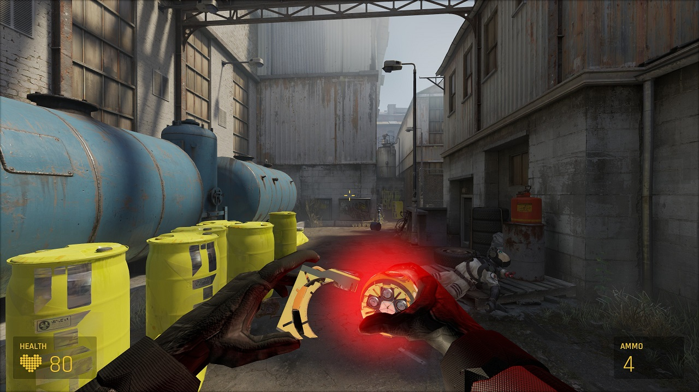
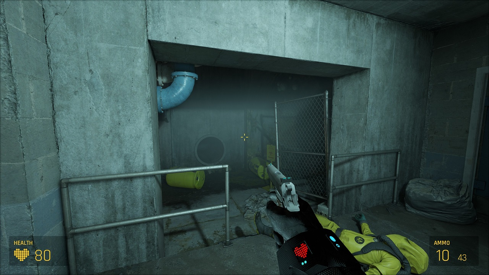
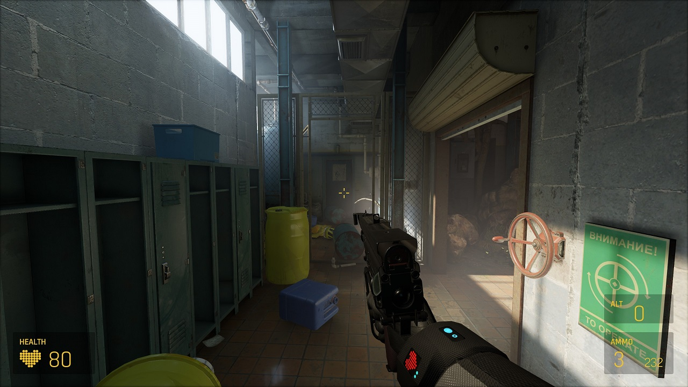
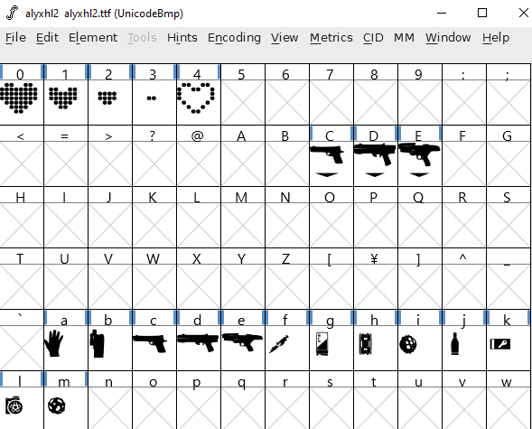

# HLA-NoVR addon mod alyxhl2 ui and weapons
Unofficial custom viewmodels for the hla novr mod

## addon mod content
- custom ui
- alyxhl2 custom font (ui icons)
- viewmodel pistol
- viewmodel shotgun
- viewmodel grenade
- custom hands texture (optional with displays)

(The ui was adapted and merged in the base hla novr repository - source files can be found in subfolder alyxhl2_ui_source_files) 

- Viewmodel for the pistol and grenade by withoutaface
- Viewmodel shotgun is ported by me from source1 by author [Just Kris](https://gamebanana.com/mods/243462) 

Please note that the viewmodels are work-in-progress - Enjoy!

## Install alyxhl2 weapon viewmodels
In the [release section](https://github.com/withoutaface/HLA-NoVR-alyxhl2-ui-weapons/releases) you can find a addon package for the hla novr mod. 
- Install the original hla novr mod from github or moddb
- Download the weapon viewmodels from the [release section](https://github.com/withoutaface/HLA-NoVR-alyxhl2-ui-weapons/releases)
- Unzip it and paste the content to your HL Alyx installation (including novr mod!)
- (Optional back up game/hlvr/gameinfo.gi before pasting the zip content)
- (Optional download and paste the hands_with_display package if you like it (install viewmodel package first!))

## Videos and screenshots
[Video release preview 2](https://youtu.be/m_roPnFAIdM)

[Video release preview 1](https://youtu.be/smotVBQMiDs)

# HLA-NoVR
NoVR Script for Half-Life: Alyx

Mod repository note: due to regular (and huge) NoVR main mod changes, I'm constantly updating this repo by manually making reset to clear state, and applying all mod support changes again.

## Mod support
With this fork of NoVR mod, you will be able to also play & complete next modifications (you can get them from Steam Workshop):
- ``Levitation`` (campaign, 7 maps + intro)
- ``Extra-Ordinary Value`` (campaign, 4 maps) 
- ``Resident Alyx: biohazard`` (campaign, 6 maps + epilogue)
- ``GoldenEye Alyx 007 - Dam`` (part 1)
- ``Belomorskaya Station`` (1 map)
- ``Overcharge`` (1 map)
- ``Red Dust`` (1 map)

## Wrist pockets
Also you will be able to carry some objects in pockets, like in original game. Most of objects will be placed into pockets only by pulling them with Gravity Gloves. Press Z button to use available health pen, press X to use grenade (they're limited to 1 on hands only), and press C to drop one of objects from pockets.
Items you can carry: ``Health Pen, Grenade, Combine Battery, Key Cards, Health Station Vials, Vodka``.

## Installation
Copy the ``game`` folder into your main Half-Life: Alyx installation folder (e.g. ``C:\Program Files (x86)\Steam\steamapps\common\Half-Life Alyx``).

## Playing
Start the game with the launch options ``-novr -vsync``.

You can also get the NoVR Map Edits addon for smoother traversal and less out of bounds glitches: https://steamcommunity.com/sharedfiles/filedetails/?id=2956743603

## Controls
To change the controls/rebind buttons, edit ``game\hlvr\scripts\vscripts\bindings.lua`` in your main Half-Life: Alyx installation folder.
### Keyboard and Mouse
Left Click: Select in Main Menu/Throw Held Object/Primary Attack

W, A, S, D: Move

Space: Jump

Ctrl: Crouch

Shift: Sprint

E: Interact/Pick Up Object

F: Flashlight (if you have it)

H: Cover your mouth

F5: Quick Save

F9: Quick Load

M: Main Menu

P: Pause

V: Noclip (if you get stuck)

## Official Discord Server
https://discord.gg/AyfBeuZXsR

## Special Thanks
- JJL772 for making the flashlight and jump scripts: https://github.com/JJL772/half-life-alyx-scripts
- Withoutaface for making the amazing HUD: https://github.com/withoutaface/HLA-NoVR-alyxhl2-ui-weapons
- FrostElex for Storage script from his tools package: https://github.com/FrostSource/hla_extravaganza
