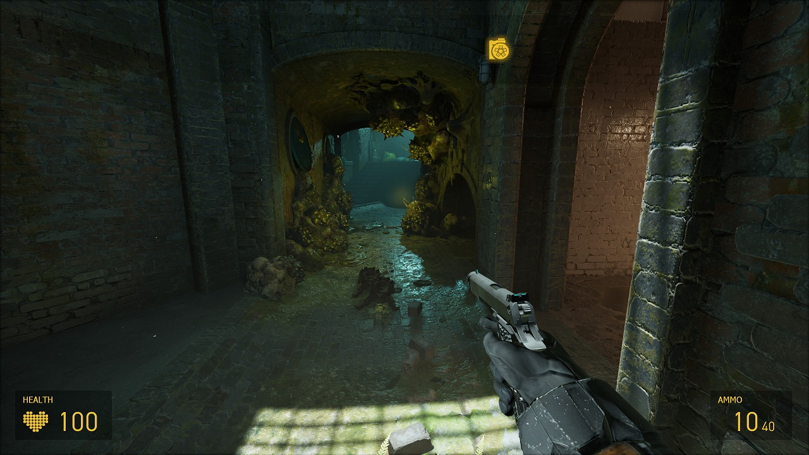

# HLA-NoVR + alyxhl2 ui and weapons
NoVR Script for Half-Life: Alyx

## alyxhl2 ui and weapons
Addon adds a custom ui, alyx font and viewmodels for the pistol and shotgun.
(The ui was adapted and merged in the base hla novr repository - source files can be found in subfolder alyxhl2_ui_source_files) 
Viewmodel for the pistol was created by myself, the shotgun viewmodel is ported from source1 by author [Just Kris](https://gamebanana.com/mods/243462) 

Please note that the viewmodels are work-in-progress - Enjoy!

## Install alyxhl2 weapon viewmodels
In the [release section](https://github.com/withoutaface/HLA-NoVR-alyxhl2-ui-weapons/releases) you can find a addon package for the hla novr mod. 
- Install the original mod from github or moddb
- Download the weapon viewmodels from the [release section](https://github.com/withoutaface/HLA-NoVR-alyxhl2-ui-weapons/releases)
- Unzip it and paste the content to your HL Alyx installation (including novr mod!)
- (Optional back up game/hlvr/gameinfo.gi before pasting the zip content)

[Video](https://youtu.be/smotVBQMiDs)

## Installation
Copy the ``game`` folder into your main Half-Life: Alyx installation folder (e.g. ``C:\Program Files (x86)\Steam\steamapps\common\Half-Life Alyx``).

## Playing
Start the game with the launch options ``-novr -vsync``.

You can also get the NoVR Map Edits addon for smoother traversal and less out of bounds glitches: https://steamcommunity.com/sharedfiles/filedetails/?id=2956743603

## Controls
To change the controls/rebind buttons, edit ``game\hlvr\scripts\vscripts\bindings.lua`` in your main Half-Life: Alyx installation folder.
### Keyboard and Mouse
Left Click: Select in Main Menu/Throw Held Object/Primary Attack

W, A, S, D: Move

Space: Jump

Ctrl: Crouch

Shift: Sprint

E: Interact/Pick Up Object

F: Flashlight (if you have it)

H: Cover your mouth

F5: Quick Save

F9: Quick Load

M: Main Menu

P: Pause

V: Noclip (if you get stuck)

## Official Discord Server
https://discord.gg/AyfBeuZXsR

## Special Thanks
- JJL772 for making the flashlight and jump scripts: https://github.com/JJL772/half-life-alyx-scripts
- Withoutaface for making the amazing HUD: https://github.com/withoutaface/HLA-NoVR-alyxhl2-ui-weapons
